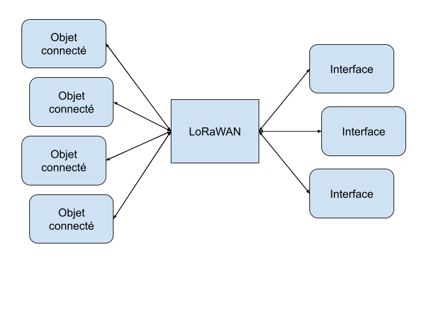
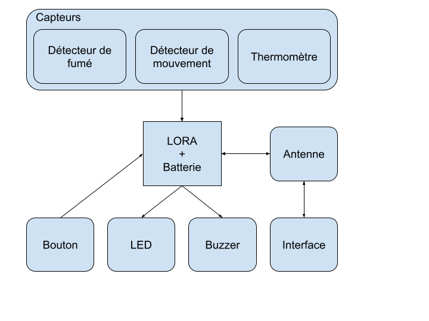
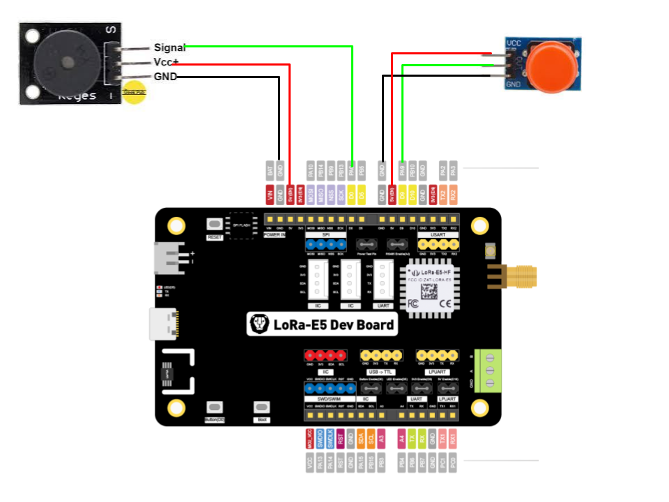
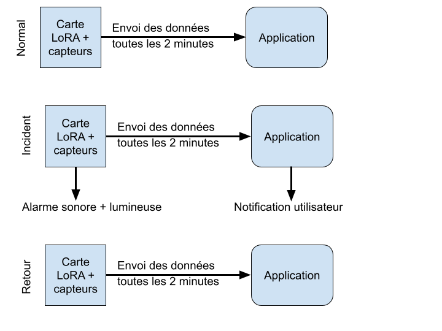
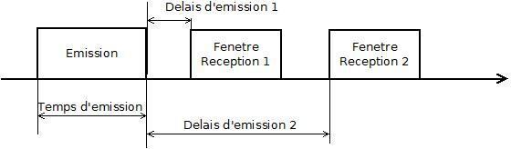
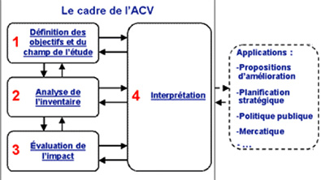

ISAAC--CHASSANDE Valentin

ROVAREY Johan

IESE5 CSC

# Mini Projet IoT 2021-2022

# “Réseau de sirènes d’alarme LoRaWAN”

## Sommaire

I. [Introduction](#intro)

II. [Architecture globale du réseau de sirènes d’alarme](#point1)

III. [Sécurité globale](#point2)

IV. [Architecture matérielle de l’objet](#point3)

V. [Coût de la BOM et des certifications du produit](#point4)

VI. [Implémentation du logiciel embarqué de l’objet défini](#point5)

VII. [Format LPP des messages LoRaWAN uplink et downlink](#point6)

VIII. [Logiciel embarqué de l’objet sirène](#point7)

IX. [Métriques logiciel du logiciel embarqué](#point8)

X. [Changements de comportement de l’objet en fonction des événements](#point9)

XI. [Durée de vie de la batterie en classe A, en classe B et en classe C](#point10)

XII. [Analyse du cycle de vie du produit (ACV)](#point11)

XIII. [Analyse des produits concurrents](#point12)

XIV. [Solutions utilisables pour localiser l’objet sirène](#point13)

XV. [Conclusion](#conclu)

## I  Introduction 

## II  Architecture globale du réseau de sirènes d’alarme 

On cherche à réaliser un objet connecté en LoRaWAN pour la sécurité des biens et des personnes.

L’objet LoRaWAN est identifié par son DevEUI et associé à une pièce ou à un lieu. Il peut être enregistré sur un réseau public national en OTAA ou sur un réseau privé en OTAA comme CampusIoT. Cet objet pourrait participer à un réseau maillé LoRa (type Amazon Sidewalk).

Pour l'instant, nous réalisons un objet connecté sur le réseau privé CampusIoT (réseau européen EU868) en activation OTAA, avec communication de classe A.

## III  Sécurité globale 

Lors de la création du device sur CampusIoT, une clé dynamique est générée (DevAddr). C’est la procédure de jonction entre la carte Lora et le réseau LoRaWAN. Des clés de session dynamiques sont alors générées et utilisées pour établir une connexion sécurisée avec la carte. C’est le mode d’activation OTAA (Over-The-Air Activation).

Voici les clés de notre objet connecté :
- DevEUI : 0xe710e3f7d77900c6 qui est l’identifiant de la carte LORA. Cet identifiant ne peut être changé.
- AppKey : 0x23ea5e66405efa4756c0fb008298f31f qui est une clé de session permettant la communication entre la carte et l’application.

Voici un schéma pour clarifier la procédure (Source : [Overview of the OTAA join procedure.  | Download Scientific Diagram (researchgate.net)](https://www.researchgate.net/figure/Overview-of-the-OTAA-join-procedure_fig1_325570245)) :

## IV  Architecture matérielle de l’objet 

Voici un schéma présentant l’architecture matérielle de notre produit :

Le produit sera piloté par une carte Lora (LORA-E5 Dev Board). Une série de capteurs permettront la détection d'événements ‘tragiques’ (changement brutal de la température, CO2, CO, fumée, etc). Le bouton poussoir permettra le déclenchement manuel d’une alerte, ainsi que son arrêt (en cas de fausse alerte). La LED et le buzzer seront les indicateurs sonores et lumineux déclenchés lors d’une alerte, soit causée par le bouton, soit détectée par les capteurs.
La carte Lora possèdera une antenne qui lui permettra une connexion au réseau LoraWan. La carte communiquera donc avec une interface à distance sur laquelle les données des capteurs seront périodiquement affichées ainsi que des informations sur les alertes, et avec laquelle on pourra envoyer des requêtes pour déclencher une alerte et paramétrer le produit.

## V  Coût de la BOM et des certifications du produit 

Pour l’instant, le produit est au début de son développement. Il est donc difficile d’estimer correctement le coût de sa BOM, mais on peut toutefois obtenir un ordre de grandeur.

BOM pour 5 000 unités à produire :
- Kits Lora (avec antenne et batterie) : 150 000 € (30 € l’unité). Une telle quantité peut amener à des réductions sur la commande.
- Boutons poussoir : 500 € (quelques centimes l’unité)
- Buzzers : 10 000 € (2 € l’unité)
- Packaging : 50 000 € (on considère 10 € par unité pour le packaging mais cette estimation reste assez flou)

A cela on peut ajouter certaine certification dont les suivantes :
Certification LoRa Alliance :
- “Annual fee: $10,000 USD · 1 free license of the LCTT included · Each additional license of the LCTT: $3,000 USD”
- Certification ETSI (signature électronique) : jusqu’à $300 USD 
A la différence de la BOM, ces certifications ne dépendent pas de la quantité d'unités produites.

On obtient donc une majoration de l’estimation du coût total pour la production de 5 000 unités : 221 000 €. C’est un coût élevé, ce qui nous poussera à chercher des moyens de le réduire le plus possible lors du développement et de la recherche de fournisseur. Cette estimation nous permet également d’entrevoir le prix de conception d’une unité : environ 44.2 €. Si le but est de faire du profit, tout en assurant un produit accessible, on a encore une marge de liberté, compte tenu des prix proposés par les produits concurrents.

## VI  Implémentation du logiciel embarqué de l’objet défini 

Pour réaliser ce projet, nous avons décidé d’utiliser des capteurs avec une communication I2C que l’on pourrait brancher directement sur la carte, mais aussi des capteurs que l’on viendrait connecter directement aux broches digitales ou analogiques.

Pour que les composants fonctionnent, il faut tout d’abord les initialiser et vérifier que plusieurs capteurs I2C ne soient pas sur la même adresse. Si tel était le cas, alors il y aurait des problèmes de communication entre les capteurs et la carte.

Pour le bouton “Panic Button”, nous pensons qu’il est préférable de mettre son traitement dans une fonction d’interruption. De ce fait, cela évitera au programme principal de scruter en permanence l’état du bouton.

Pour le buzzer et l’alarme, nous pensons qu’il vaut mieux mettre leur code dans un thread qui aurait une priorité plus élevée que le programme principal de telle sorte que s’il y a une alerte, l’alarme soit à coup sûr fonctionnelle et fluide.

Pour les capteurs, notre idée est de faire les mesures périodiquement au sein du programme principal pour que l’on ait en permanence des mesures.

La communication LoRa sera elle aussi gérée dans le programme principal, le but étant de ne pas transmettre des données trop fréquemment mais seulement une fois de temps en temps.

## VII  Format LPP des messages LoRaWAN uplink et downlink 

myDevices a créé le Cayenne Low Power Payload (LPP) qui offre un moyen pratique et facile d'envoyer des données sur des réseaux LPWAN tels que LoRaWAN. Le Cayenne LPP est conforme à la restriction de taille de la charge utile, qui peut être réduite à 11 octets, et permet au dispositif d'envoyer les données de plusieurs capteurs en même temps.

En outre, le Cayenne LPP permet au dispositif d'envoyer des données de capteur différentes dans des trames différentes. Pour ce faire, chaque donnée de capteur doit être préfixée de deux octets :
- Canal de données : Identifie de manière unique chaque capteur du dispositif dans les trames, par exemple "capteur intérieur".
- Data Type : Identifie le type de données dans la trame, par exemple "température".

Les Data Types sont conformes aux directives Smart Objects de l'Alliance IPSO, qui identifie chaque type de données par un "Object ID". Toutefois, comme indiqué ci-dessous, une conversion est effectuée pour faire tenir l'Object ID dans un seul octet.

LPP_DATA_TYPE = IPSO_OBJECT_ID - 3200

Chaque type de données peut utiliser un ou plusieurs octets pour envoyer les données selon le tableau suivant.

Type | IPSO | LPP | Hex | Data Size | Data Resolution per bit
---|---|---|---|---|---
Digital Input | 3200 | 0 | 0 | 1 | 1
Digital Output | 3201 | 1 | 1 | 1 | 1
Analog Input | 3202 | 2 | 2 | 2 | 0.01
Analog Output | 3203 | 3 | 3 | 2 | 0.01
Illuminance Sensor | 3301 | 101 | 65 | 2 | 1
Presence Sensor | 3302 | 102 | 66 | 1 | 1
Temperature Sensor | 3303 | 103 | 67 | 2 | 0.1°C Signed MSB
Humidity Sensor | 3304 | 104 | 68 | 1 | 0.5 % Unsigned
Accelerometer | 3313 | 113 | 71 | 6 | 0.001 G Signed MSB per axis
Barometer | 3315 | 115 | 73 | 2 | 0.1 hPa Unsigned MSB
Gyrometer | 3334 | 134 | 86 | 6 | 0.01 °/s Signed MSB per axis
GPS Location | 3336 | 136 | 88 | 9 | Latitude : 0.0001 ° Signed MSB
GPS Location | 3336 | 136 | 88 | 9 | Longitude : 0.0001 ° Signed MSB
GPS Location | 3336 | 136 | 88 | 9 | Altitude : 0.01 meter Signed MSB

Exemples :

1. Appareil avec deux capteurs de température :

Payload (Hex) : 03 67 01 10 05 67 00 FF
Data Channel | Type | Value
--- | --- | ---
03 ⇒ 3 | 67 ⇒ Temperature | 0110 = 272 ⇒ 27.2°C
05 ⇒ 5 | 67 ⇒ Temperature | 00FF = 255 ⇒ 25.5°C

2. Appareil avec capteurs de température et d’accélération :
- Frame N

Payload (Hex) : 01 67 FF D7
Data Channel | Type | Value
--- | --- | ---
01 ⇒ 1 | 67 ⇒ Temperature | FFD7 = -41 ⇒ -4.1°C

- Frame N+1

Payload (Hex) : 06 71 04 D2 FB 2E 00 00
Data Channel | Type | Value
--- | --- | ---
06 ⇒ 6 | 71 ⇒ Accelerometer | X: 04D2 = +1234 => + 1.234G
06 ⇒ 6 | 71 ⇒ Accelerometer | Y: FB2E = -1234 => - 1.234G
06 ⇒ 6 | 71 ⇒ Accelerometer | Z: 0000 = 0 => 0G

## VIII  Logiciel embarqué de l’objet sirène 

Actuellement, l’alarme sonore et le buzzer sont gérées dans un thread avec une priorité élevée, ce qui lui permet de ne pas être interrompu. Dans ce thread, il y a une boucle infinie qui génère les oscillations du pwm pour créer le son de l’alarme.

La gestion du bouton est quant-à elle gérée dans une interruption, de telle sorte que lorsque l’utilisateur appuie sur le bouton, une série d’instructions est exécutée. Dans l’interruption, si le bouton est pressé, nous allumons la led rouge et nous réveillons le thread de l’alarme. Si le bouton est pressé une seconde fois alors le thread se désactive et la led s’éteint.

Dans le programme principal, nous lisons périodiquement la température grâce au capteur déjà intégré. Ensuite, cette valeur est envoyée à l’interface connectée où elle sera affichée. Si la température dépasse une certaine limite fixée, alors le thread de l’alarme se déclenche et la led rouge s’allume.

Dans les choses que nous aimerions ajouter, il y a notamment des capteurs (détecteur de fumée, détecteur de présence, ...). Pour cela, notre idée était d’effectuer périodiquement des mesures dans le programme principal, comme la température. Ensuite, en cas de problème (fumée détectée, ...), le thread de l’alarme serait déclenché. Il est prévu aussi de réaliser l’affichage des valeurs mesurées dans l’interface et d’envoyer un message d’alerte en cas de détection de problème.

## IX  Métriques logiciel du logiciel embarqué 

Actuellement, notre code fait 175 lignes mais il nous reste des composants que l’on pourrait ajouter comme le détecteur de fumée ou bien un détecteur de personne.

Le firmware implémenté sur la carte à une taille de 42.7 Ko alors que la carte est munie d’une ROM de 256 Ko et d’une RAM de 64 Ko. Donc nous avons encore assez de mémoire disponible pour ajouter les composants que l’on voudrait.

## X  Changements de comportement de l’objet en fonction des événements 

## XI  Durée de vie de la batterie en classe A, en classe B et en classe C 

Qu’est-ce que les classes dans un protocole de communication LoraWan ?

Le protocole définit trois classes d'équipements (A, B et C). La classe A doit être implémentée dans tous les équipements par souci de compatibilité. Un équipement peut changer de classe en cours de fonctionnement.
- Classe A : Cette classe a la consommation énergétique la plus faible. Lorsque l'équipement a des données à envoyer, il le fait sans contrôle puis il ouvre deux fenêtres d'écoute successives pour des éventuels messages provenant du serveur, les durées recommandées sont de 1 puis 2 secondes. Ces 2 fenêtres sont les seules durant lesquelles le serveur peut envoyer à l'équipement les données qu'il a précédemment stockées à son attention.

- Classe B : Cette classe permet un compromis entre la consommation énergétique et le besoin en communication bi-directionnelle. Ces équipements ouvrent des fenêtres de réception à des intervalles programmés par des messages périodiques envoyés par le serveur.
- Classe C : Cette classe a la plus forte consommation énergétique mais permet des communications bi-directionnelles n'étant pas programmées. Les équipements ont une fenêtre d'écoute permanente.

Dans notre cas, une utilisation en classe A convient tout à fait car la transmission des données vers l’interface n’a pas besoin d’être précise, et surtout notre produit fonctionne sur batterie et doit donc consommer le moins possible.

En terme de batterie, on utilise deux piles 3V de type AA. Les plies les plus utilisées par le grand public étant les piles alcalines, on peut considérer que notre batterie délivre 2500 mAh. De plus, on communique en LoRaWAN toutes les 2 minutes (sample time = 120s), en mode SF7 (spreading factor) car il n’est pas nécessaire d’avoir plus de bit pour notre application.
Sachant cela et les caractéristiques de notre batterie, nous pouvons estimer sa durée de vie (caractéristiques supplémentaires : Capteur ERS Co2 ; Performance de la batterie : 80%). En utilisant BATTERY LIFE CALCULATOR de ELSYS.se ([Battery life calculator – en (elsys.se)](https://www.elsys.se/en/battery-life-calculator/)), on obtient 1.6 ans.

## XII  Analyse du cycle de vie du produit (ACV) 

Réaliser une ACV (Analyse du Cycle de Vie) complète et détaillée serait long et fastidieux. Nous allons ici nous contenter d’analyser les objectifs de notre projet et d’en mesurer les impacts.

L’objectif principal de notre produit est d’assurer la sécurité des bâtiments contre les incendies en les détectant efficacement et en prévenant les personnes proches du danger à l’aide d’indicateurs sonores et lumineux. Cela implique que quelque soit nos choix de conception de l’appareil et de ses fonctionnalités, ceux-ci ne doivent pas compromettre l’objectif principal de sécurité.
Par exemple, si la carte devait consommer trop, on ne devrait pas envisager comme solution de choisir un buzzer de plus faible consommation car il serait moins puissant, alors qu’il est l’indicateur d’alerte principal du détecteur.
Pour rebondir sur la consommation, un des principaux impacts écologiques de notre produit est l’utilisation d’une batterie de type pile AA fois deux. Pour limiter cet impact, en dehors de recommander des piles rechargeables, on peut s’assurer d’une durée de vie élevée de la batterie en faisant les bons choix pendant le développement du produit.

## XIII  Analyse des produits concurrents 

Voici un tableau récapitulatif des produits concurrents que l’on peut trouver sur le marché :

Produits concurrents | Avantages | Inconvénients
--- | --- | ---
Avertisseur vocal connecté 126 dB Radio LoRa SmartVOX® [Avertisseur vocal connecté 126 dB Radio LoRa - SmartVOX® - AE&T (aet.fr)](https://www.aet.fr/produit/avertisseur-vocal-connecte-126-db-radio-lora-xpr901111.html) | Son puissant et configurable | Lourd et imposant / Pas d’indicateur lumineux
R602A LoRaWAN Wireless Siren [R602A LoRaWAN Wireless Siren – IQFlow Solutions](https://iqflow.io/products/r602a-lorawan-wireless-siren) | Petites dimensions / Grande portée (10 km) / Indicateurs lumineux et sonores / Frequency Hopping Spread Spectrum (FHSS) / Durée de vie de la batterie : 5 ans | Son peu puissant
MClimate CO2 Sensor and Notifier LoRaWAN [MClimate CO2 Sensor and Notifier LoRaWAN - MClimate LoRaWAN Devices](https://docs.mclimate.eu/mclimate-lorawan-devices/devices/mclimate-co2-sensor-and-notifier-lorawan) | Petites dimensions / Très faible consommation / Indicateur lumineux RGB | Son très peu puissant

On remarque qu’il y a différents types de produits selon les conditions d’utilisation. Le premier par exemple conviendrait mieux pour une utilisation dans une usine ou un grand espace alors que les deux suivants sont conçus pour une utilisation domestique, pour les pièces d’une maison ou toutes salles de petites tailles.

## XIV  Solutions utilisables pour localiser l’objet sirène 

Il y a différentes solutions envisageables pour localiser les produits. Voici deux d’entre elles :

- Solution 1 :

Utilisation du LBS (Localisation Based Services) sur LoRa. Cette solution permet de localiser les émetteurs radio LoRa en s’affranchissant du GPS dont la consommation électrique nuit à l’autonomie des capteurs. Cette solution est en cours de développement par l’entreprise Kerlink.

- Solution 2 :

On peut utiliser le TDOA (Time Differential of Arrival). En calculant le temps que met le signal à arriver sur l’antenne on peut calculer où se situe l’objet. La fonctionnalité permet donc de localiser l’objet avec une précision de 50 mètres en milieu urbain, 100 mètres dans les environnements périurbains et 250 mètres dans les zones peu denses. Il faut au moins trois antennes pour assurer la triangulation du signal.
La TDOA a pour avantage de ne pas consommer d’énergie supplémentaire du côté de l’objet (au-delà de l’émission normale du signal), ce qui est très intéressant pour notre application.

## XV Conclusion 

