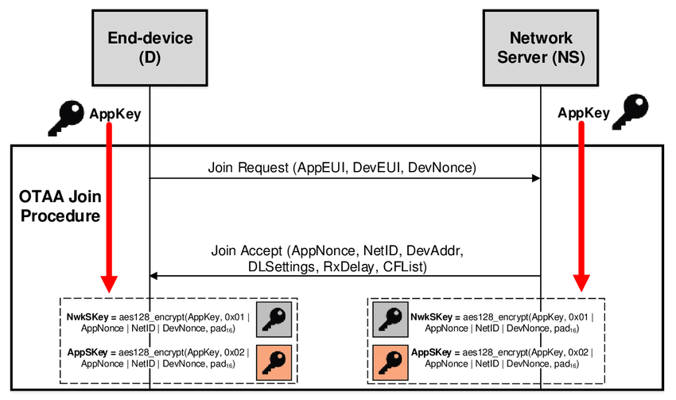

# H1
## H2
### H3
#### H4
##### H5
###### H6

Alternatively, for H1 and H2, an underline-ish style:

Alt-H1
======

Alt-H2
------

https://github.com/ValFlashIC/MiniProjetIoT.git
https://github.com/ValFlashIC/MiniProjetIoT/Images/Overview-of-the-OTAA-join-procedure.png

Here's our logo (hover to see the title text):

Inline-style: 

Reference-style: 
![alt text][logo]

[logo]: https://github.com/ValFlashIC/MiniProjetIoT/raw/master/Images/consommer_acv-4etapes_ademe.jpg "Logo Title Text 2"

ISAAC--CHASSANDE Valentin

ROVAREY Johan

IESE5 CSC

# Mini Projet IoT 2021-2022

# “Réseau de sirènes d’alarme LoRaWAN”

## Sommaire

I. [Introduction](#intro)

II. [Architecture globale du réseau de sirènes d’alarme](#point1)

III. [Sécurité globale](#point2)

IV. [Architecture matérielle de l’objet](#point3)

V. [Coût de la BOM et des certifications du produit](#point4)

VI. [Implémentation du logiciel embarqué de l’objet défini](#point5)

VII. [Format LPP des messages LoRaWAN uplink et downlink](#point6)

VIII. [Logiciel embarqué de l’objet sirène](#point7)

IX. [Métriques logiciel du logiciel embarqué](#point8)

X. [Changements de comportement de l’objet en fonction des événements](#point9)

XI. [Durée de vie de la batterie en classe A, en classe B et en classe C](#point10)

XII. [Analyse du cycle de vie du produit (ACV)](#point11)

XIII. [Analyse des produits concurrents](#point12)

XIV. [Solutions utilisables pour localiser l’objet sirène](#point13)

XV. [Conclusion](#conclu)

## I  Introduction 

## II  Architecture globale du réseau de sirènes d’alarme 

## III  Sécurité globale 

## IV  Architecture matérielle de l’objet 

## V  Coût de la BOM et des certifications du produit 

## VI  Implémentation du logiciel embarqué de l’objet défini 

## VII  Format LPP des messages LoRaWAN uplink et downlink 

## VIII  Logiciel embarqué de l’objet sirène 

## IX  Métriques logiciel du logiciel embarqué 

## X  Changements de comportement de l’objet en fonction des événements 

## XI  Durée de vie de la batterie en classe A, en classe B et en classe C 

## XII  Analyse du cycle de vie du produit (ACV) 

## XIII  Analyse des produits concurrents 

## XIV  Solutions utilisables pour localiser l’objet sirène 

## XV Conclusion 

